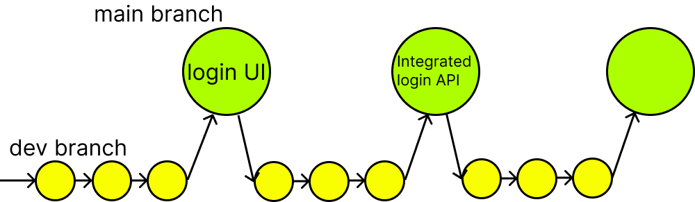

Git Collaboration Challenge

Background:

In your role as a developer for the "TechBlog" web application project, you are part of a team that uses Git for version control and collaboration. The project's main branches are main and develop.

Task:

This challenge has been designed to gauge your grasp of the Git commit process, specifically focusing on committing changes to the 'main' branch for individual features. It's important to note that the scope of this task is confined to your **local** Git repository, and remote repository pushes are not required.

  

For this task, your objective is to create a user interface that facilitates the login process, along with a functional demo login feature. Follow these steps to complete the task:

- Create a new branch from the 'develop' branch. Use a descriptive name that indicates the feature you're working on.

- Implement the changes necessary for the new feature within this branch. Regularly commit your progress as you make incremental changes.

- Once the feature is fully developed and tested within your branch, merge the changes back into the 'main' branch using an appropriate merge strategy (e.g., merge commit or rebase).

- Accompany the merge with clear and concise commit messages that describe the added feature comprehensively.

- For the backend component, please utilize the docker image and files provided in 'question1'.

- Keep in mind that the primary focus of this challenge is to showcase your ability to manage feature-specific branches, commit changes within those branches, and integrate those features back into the 'main' branch with informative commit messages.

For the backend component, kindly employ the docker image and files from 'question1'.
